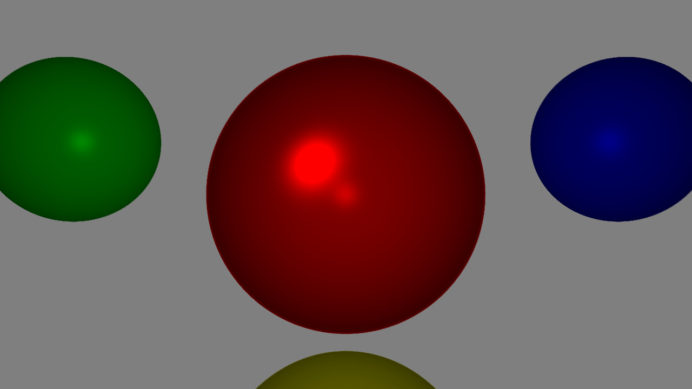

# Raytracer
This project is a software raytracer build with C++17

## Current Features
- Scenes
- Materials
- Ambient Lighting
- Directional Lighting
- Point Lighting with Attenuation
- Diffuse Lighting
- Specular Reflections
- Supersampling

## Currently Implementing
- Shadows
- Mirror Reflections

## Example Render
